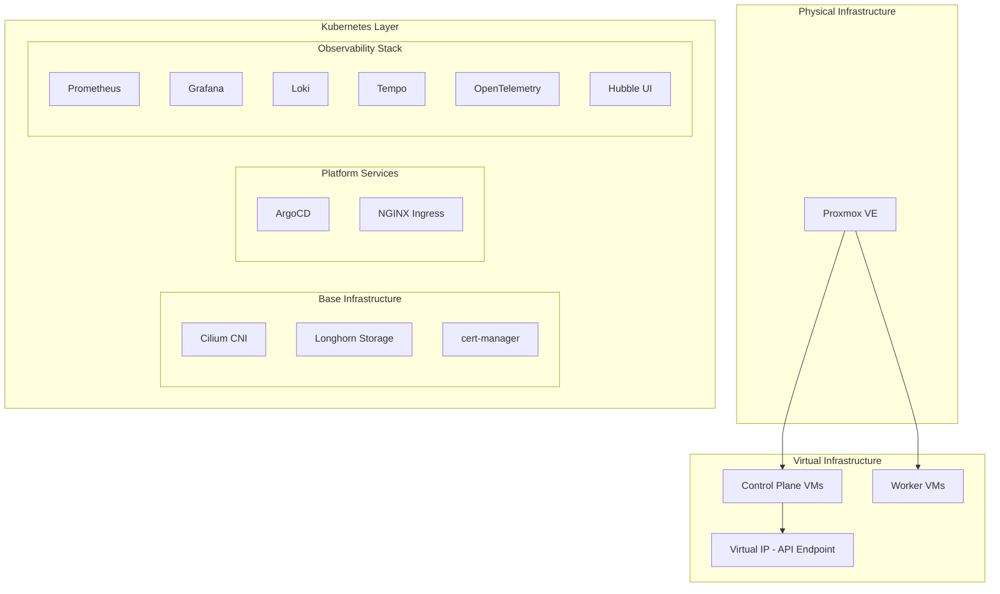

# 🚀 VaultLan Talos Kubernetes Cluster

A production-grade, secure, and modular Kubernetes cluster built with Talos Linux, OpenTofu (Terraform), and Proxmox VE. This project provides a fully automated, infrastructure-as-code approach to deploying and managing a robust Kubernetes environment.

## 🎯 Project Overview

This project creates a production-ready Kubernetes cluster that emphasizes:

- 🔒 Security-first architecture with Talos Linux
- 🏗️ Infrastructure as Code (IaC) using OpenTofu
- 📦 GitOps-based application deployment
- 🔍 Comprehensive monitoring and observability
- 💾 Distributed storage with Longhorn
- 🌐 Advanced networking with Cilium

### Why Talos?

Talos Linux was chosen as our immutable operating system for several compelling reasons:

- **Immutable Infrastructure**: The system partitions are read-only, reducing attack surface and ensuring consistency
- **Minimal Attack Surface**: No shell, no SSH, and no unnecessary packages
- **API-driven**: All system management is done through a secure gRPC API
- **Built for Kubernetes**: Purpose-built for running Kubernetes, nothing else
- **Automated Updates**: Built-in automated updates with rollback capability
- **High Security**: Follows the CIS benchmarks by default

## 🏗️ Architecture Diagram



## 🛠️ Technology Stack

### Infrastructure & OS
| Component | Description |
|-----------|-------------|
| Proxmox VE | Virtualization platform for hosting cluster nodes |
| Talos Linux | Security-focused, minimal OS for Kubernetes |
| OpenTofu | Infrastructure as Code tool for provisioning |

### Networking & Security
| Component | Description |
|-----------|-------------|
| Cilium | eBPF-based networking, security, and observability |
| NGINX Ingress | Kubernetes ingress controller |
| cert-manager | Automated certificate management |

### Storage
| Component | Description |
|-----------|-------------|
| Longhorn | Cloud-native distributed block storage |

### GitOps & Package Management
| Component | Description |
|-----------|-------------|
| ArgoCD | GitOps continuous delivery tool |
| Helm | Kubernetes package manager |

### Observability Stack
| Component | Description |
|-----------|-------------|
| Prometheus | Metrics collection and alerting |
| Grafana | Metrics visualization and dashboards |
| Loki | Log aggregation system |
| Tempo | Distributed tracing backend |
| OpenTelemetry | Observability framework |
| Hubble | Network and security observability |

## 📐 Cluster Layout & IP Design

The cluster is designed with the following network architecture:

- **Network CIDR**: ${cluster_node_network} (192.168.20.0/24)
- **API Load Balancer VIP**: ${cluster_vip} (192.168.20.50)
- **Node IP Ranges**:
  - Control Plane: 192.168.20.80-89
  - Worker Nodes: 192.168.20.90-99
  - Load Balancer Pool: 192.168.20.130-230

### Hardware Requirements

#### Control Plane Nodes
- CPU: 4 cores (minimum 2)
- Memory: 8GB RAM (minimum 2GB)
- Disk: 40GB

#### Worker Nodes
- CPU: 4 cores (minimum 4)
- Memory: 8GB RAM (minimum 8GB)
- OS Disk: 40GB
- Longhorn Disk: 60GB (or more based on workload)

## 🚀 Getting Started

### Prerequisites

1. Install required tools:
   ```bash
   # Install OpenTofu
   curl --proto '=https' --tlsv1.2 -fsSL https://get.opentofu.org/install-opentofu.sh | sudo sh

   # Install Talosctl
   curl -sL https://talos.dev/install | sh

   # Install kubectl
   curl -LO "https://dl.k8s.io/release/$(curl -L -s https://dl.k8s.io/release/stable.txt)/bin/linux/amd64/kubectl"
   sudo install -o root -g root -m 0755 kubectl /usr/local/bin/kubectl
   ```

2. Configure Proxmox credentials:
   ```bash
   export PROXMOX_VE_USERNAME="root@pam"
   export PROXMOX_VE_PASSWORD="your-password"
   ```

### Deployment Steps

1. **Initialize Infrastructure:**
   ```bash
   cd 01-infra
   tofu init
   tofu plan
   tofu apply
   ```

2. **Configure Kubernetes Access:**
   ```bash
   # Configure Talos access
   tofu output -raw talosconfig > ~/.talos/config
   
   # Configure kubectl
   tofu output -raw kubeconfig > ~/.kube/config
   chmod 600 ~/.kube/config
   ```

3. **Bootstrap Platform Services:**
   ```bash
   cd ../02-bootstrap
   helmfile sync
   ```

4. **Deploy GitOps and Monitoring:**
   ```bash
   cd ../03-gitops
   kubectl apply -f applications/01-platform-bootstrap.yaml
   kubectl apply -f applications/02-monitoring-bootstrap.yaml
   ```

## 📊 Usage

### Accessing Dashboards

The following services are available through ingress:

- ArgoCD: https://argocd.cluster
- Grafana: https://grafana.cluster
- Hubble UI: https://hubble.cluster
- Longhorn UI: https://longhorn.cluster
- Jaeger UI: https://jaeger.cluster

### Deploying Applications

1. Create your application manifests in the `03-gitops/apps` directory
2. Create an ArgoCD application in `03-gitops/applications`
3. Apply the configuration:
   ```bash
   kubectl apply -f 03-gitops/applications/your-app.yaml
   ```

### Monitoring and Observability

- **Metrics**: Available through Prometheus and visualized in Grafana
- **Logs**: Centralized in Loki and queryable through Grafana
- **Traces**: Collected by OpenTelemetry and viewable in Jaeger
- **Network**: Monitor with Hubble UI for Cilium network flows

## 🔐 Security Considerations

1. **Immutable Infrastructure**
   - Talos Linux provides a read-only file system
   - No SSH access or shell reduces attack surface
   - Automated updates with rollback capability

2. **Network Security**
   - Cilium provides eBPF-based network policies
   - Layer 4 load balancing with kube-proxy replacement
   - Network flow monitoring with Hubble

3. **Access Control**
   - RBAC implemented across all components
   - Certificate-based authentication with cert-manager
   - API access through secure gRPC

4. **Monitoring and Audit**
   - Full observability stack for security monitoring
   - Network flow logs with Hubble
   - Prometheus alerts for security events

## 📝 License

This project is licensed under the MIT License - see the LICENSE file for details.
